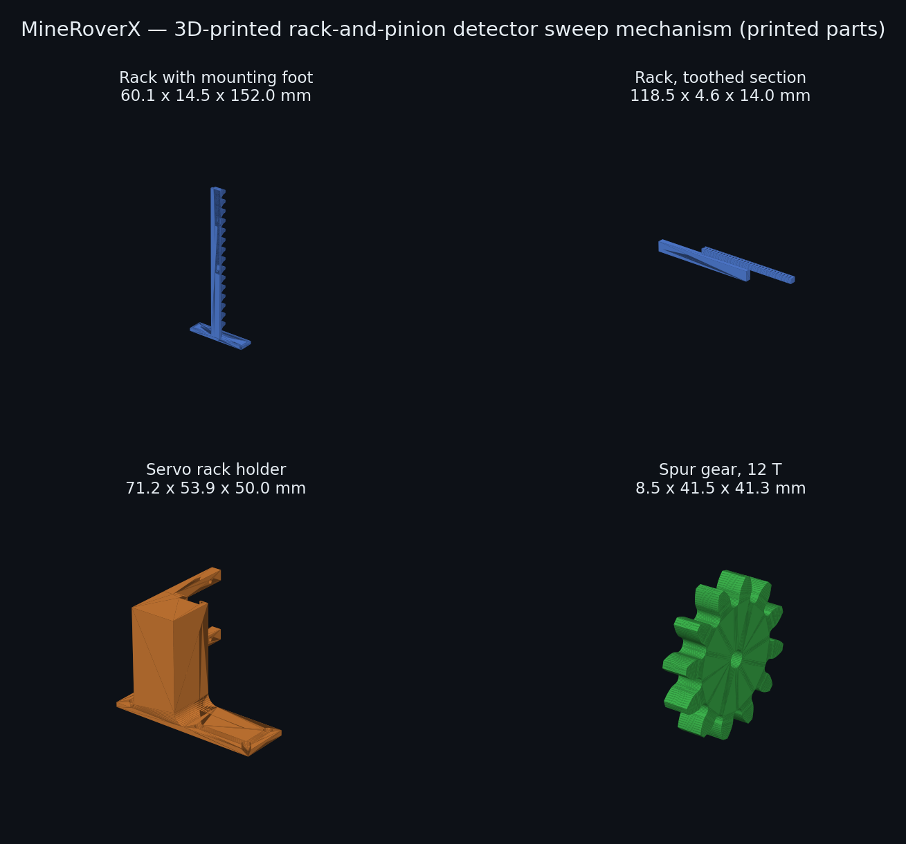
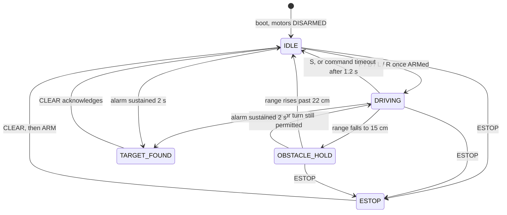
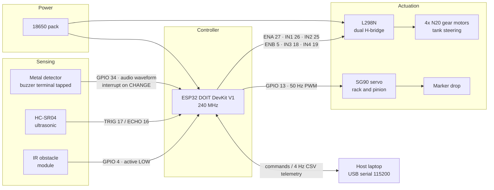

# MineRoverX

**A four-wheeled ground robot that sweeps for buried metal, stops when it finds
something, and drops a marker where it stopped.**

Custom-designed chassis, 3D-printed rack-and-pinion sweep mechanism, ESP32
firmware, and a metal detector that had to be physically modified before it
could talk to a microcontroller at all.

[](https://github.com/Kunz5/mine-rover-x/actions/workflows/firmware-tests.yml)
[](https://www.espressif.com/en/products/socs/esp32)
[](test/)
[](LICENSE)



*Above: the printed parts of the detector sweep mechanism, rendered from the
STL sources in [`hardware/cad/`](hardware/cad/). Photographs of the assembled
rover are pending.*

---

## The problem

Landmine clearance is slow because it has to be. A deminer advances on foot,
sweeping a handheld detector in arcs, and every metallic return has to be
investigated by hand. The overwhelming majority of those returns are scrap —
nails, shell fragments, bottle caps — but each one is treated as live until
proven otherwise, because the cost of being wrong once is a person.

Two things about that process are mechanical rather than human: *moving the
detector head across the ground in a controlled pattern*, and *marking the exact
spot where a return occurred*. Those are the parts a machine can take over
without needing to make any judgement about what it found.

## What I built

MineRoverX is a small ground platform that does exactly those two jobs. It
drives, it carries a metal detector on a servo-driven sweep mechanism, it stops
when the detector alarms, and it drops a physical marker at that spot for a human
to investigate. It does not attempt to classify what it found, and it does not
attempt to decide whether anything is safe. That distinction is deliberate.

The engineering interest is not in the concept. It is in the three problems the
build actually threw at me.

---

## Problem 1 — the detector had no way to talk to anything

The metal detector module has no data pin. No serial, no comparator output, no
logic-level "found something" line. Its only output is an audible alarm.

So I opened it and **soldered directly onto the buzzer terminal**, and ran that
into a GPIO on the ESP32.

That solves the wiring and creates a signal-processing problem, because what
arrives at the pin is not a level — it is an **audio-frequency waveform**. While
the alarm is sounding, that line is flipping hundreds of times a second. A naive
`digitalRead(pin) == HIGH` would be wrong roughly half the times it sampled, and
would report detections and non-detections essentially at random.

The correct question is not *"is the line high"* but *"is the line oscillating"*.

So the firmware does envelope detection:

1. An interrupt on `CHANGE` counts every transition on the tapped line.
2. Every 100 ms, the accumulated edge count is read and cleared. Twenty or more
   edges in a window means a tone of at least ~100 Hz — the alarm is sounding.
3. A detection is only **committed** once the alarm has sounded continuously for
   two seconds. This rejects the short chirps the module emits at power-up and
   when it is swung quickly across uneven ground.
4. A brief dropout mid-alarm does not reset the accumulated hold. Only 400 ms of
   sustained silence releases it.

The `CAL` command prints the live edge rate against the threshold, so the
detector can be recalibrated in the field for different soil and different
battery voltages without recompiling.

```
# edges/100ms=63 threshold=20 toneHeld=1400/2000
```

This is the part of the project I would most want to be asked about. The
hardware limitation forced a genuinely different firmware design, and the
resulting detector is more robust than a clean digital output would have been —
because it measures *how long the alarm has been sounding*, not merely whether
it is on at the instant it was sampled.

---

## Problem 2 — v2 worked, and was still unsafe to drive

The firmware that actually ran on the rover (`firmware/v2_baseline/`, preserved
unmodified) demoed fine on a bench and contained three defects that only matter
on real ground:

| | Defect | Consequence |
|---|---|---|
| 1 | `pulseIn()` returns `0` on timeout; v2 tested `distance <= 15` | **A completely clear path read as an obstacle 0 cm away.** The rover braked on open ground. |
| 2 | The obstacle branch `return`ed before the serial read | **Once triggered, no command could be received** — including reverse. The rover had to be picked up. |
| 3 | Motion commands latched the motors on with no timeout | **A dropped serial link meant an uncommanded runaway** until it hit something or the battery died. |

For a platform whose purpose is to move slowly over ground that may contain
buried ordnance, defect 3 is the one that actually matters.

`firmware/v3/` is a rewrite, not a patch: a non-blocking state machine with no
`delay()` in `loop()`, serial serviced unconditionally on every iteration,
median-filtered ranging that fails toward "clear" instead of toward "obstacle",
a 1.2 s deadman timeout, hysteresis on the obstacle threshold, soft-start
ramping to protect the N20 gearboxes, real LEDC PWM at 20 kHz, and a latching
emergency stop.

**Full diagnosis: [`docs/firmware-postmortem.md`](docs/firmware-postmortem.md).**

### The v3 state machine

Commands set *intent*. State is derived from the sensors on every 20 ms control
tick — never assigned by the command handler. That separation is the fix for the
bug the test suite caught.



The 15 cm stop and 22 cm resume are deliberately different. A single threshold
made the rover chatter in and out of the hold at the boundary; the gap between
them is hysteresis.


---

## Problem 3 — testing embedded code without a board

Firmware that can only be tested by flashing it mostly doesn't get tested. Every
part of v3 that isn't a register write is pure logic, so I stubbed the Arduino
HAL and compile the sketch on a host machine.

```bash
cd test && g++ -std=c++17 -I. -o test_v3 test_v3.cpp && ./test_v3
```

```
42 passed, 0 failed
```

The suite covers ultrasonic out-of-range handling, median filtering, command
parsing and clamping, the deadman timeout, obstacle hysteresis, the full
envelope-detection state machine, the marker drop sequence, soft-start ramping,
and emergency stop latching. Simulated hardware — echo timings, buzzer edge
counts, elapsed time — is injected by the tests.

**It immediately earned its keep.** The first version of v3 assigned the state
machine directly from the command handler, so reversing away from an obstacle
overwrote `OBSTACLE_HOLD` and a forward command became legal again *while the
obstacle was still 10 cm ahead*. The tests caught it in under a second. v3 now
separates operator *intent* from machine *state*, and derives state from the
live sensor reading on every control tick.

---

## Mechanical design

The chassis and the detector sweep mechanism are my own, modelled in Fusion 360
and 3D printed. Every off-the-shelf component — the ESP32 board, L298N, N20
motors, SG90, relay, 18650 holder — was modelled or sourced into the assembly
first, so parts were fit-checked digitally before anything was printed.

| Part | Size | Role |
|---|---|---|
| Rack with mounting foot | 60.1 x 14.5 x 152.0 mm | 152 mm of linear travel for the detector head |
| Rack, toothed section | 118.5 x 4.6 x 14.0 mm | Drive tooth profile |
| Servo rack holder | 71.2 x 53.9 x 50.0 mm | Mounts the SG90 and constrains the rack |
| Spur gear, 12 T | 41.5 mm dia. x 8.5 mm | Servo output to rack |

Both the chassis and the sweep mechanism were iterated — chassis v1 → v2, dumper
mechanism v4 → v5. Sources are in [`hardware/cad/`](hardware/cad/) as STEP,
STL, 3MF and F3D.

---

## Hardware

ESP32 DOIT DevKit V1 · L298N dual H-bridge · 4x N20 gear motors · HC-SR04
ultrasonic · IR obstacle module · metal detector module (buzzer line tapped) ·
SG90 servo · 1-channel relay · 18650 pack



> **Power note.** The ESP32 must not be run from the L298N's 5 V regulator while
> the motors are loaded — the rail sags on current spikes and the ESP32 browns
> out mid-command. Separate the supplies and tie the grounds.

Full pin map and power warnings: [`hardware/BOM.md`](hardware/BOM.md).

---

## Command protocol

Serial, 115200 baud, newline-terminated. Boots **disarmed**.

| Command | Effect |
|---|---|
| `ARM` / `DISARM` | Enable or disable motion |
| `F` `B` `L` `R` `S` | Forward, reverse, left, right, stop |
| `SPD <0-255>` | Target speed; ramped, not applied instantly |
| `MARK` | Drop a marker |
| `CAL` | Print live detector edge rate vs. threshold |
| `ESTOP` / `CLEAR` | Latch / release emergency stop |
| `?` | Status |

Telemetry streams at 4 Hz as CSV, so a host can log and plot a sweep:

```
T,<ms>,<state>,<range_cm>,<speed>,<detect>,<edges>,<ir>
```

---

## Status — what is and isn't true

- The rover is **built and has driven** under `firmware/v2_baseline/`.
- The detector buzzer tap is **physically done and works**.
- `firmware/v3/` is **fully tested on host but has not yet been flashed to the
  rover.** Everything above about v3 describes verified logic, not verified
  field behaviour.
- The metal detector and servo GPIO assignments in v3 (34 and 13) are
  **proposed**, not yet confirmed against the physical wiring. Every other pin
  is read directly from the firmware that ran.
- There is **no autonomous navigation.** The rover is driven over serial; it
  stops and marks on its own, but it does not plan its own path. Coverage
  planning is a separate problem I have worked on
  [here](https://github.com/Kunz5/sweep-planner).

## Limitations

- Tank steering with no encoders, so there is no odometry and no position
  estimate. A marker records *that* something was found, not *where* in any
  coordinate frame.
- The detector reports presence only. It cannot discriminate ordnance from
  scrap, which is the actual hard problem in demining.
- Ultrasonic obstacle detection only — nothing detects a drop-off or a hole.
- No IP rating, no weather sealing, indoor and dry ground only.
- Wi-Fi and Bluetooth on the ESP32 are unused; control is wired serial.

## Next

Wheel encoders for closed-loop odometry, so detections can be logged against a
position. Automatic lawnmower sweep using the coverage planner. Logging
detections to SD with timestamps and edge-rate traces.

---

## Repository layout

```
firmware/v2_baseline/   the firmware that actually drove the rover, unmodified
firmware/v3/            rewrite: non-blocking, deadman, envelope detection
test/                   host-side test suite (42 tests) + Arduino HAL stub
hardware/BOM.md         parts, pin map, power notes
hardware/cad/           chassis, rack-and-pinion, dumper mechanism sources
docs/firmware-postmortem.md   what was wrong with v2 and why it mattered
```

---

## Timeline

The rover was designed and built in **June 2025** — the chassis and sweep
mechanism in Fusion 360, the v2 firmware that drove it, and the buzzer-line tap
on the detector.

Firmware v3, the host test harness, and this documentation were written in
**August 2026**, when the project was cleaned up and published. The v2 source in
`firmware/v2_baseline/` is unmodified from the original build.
